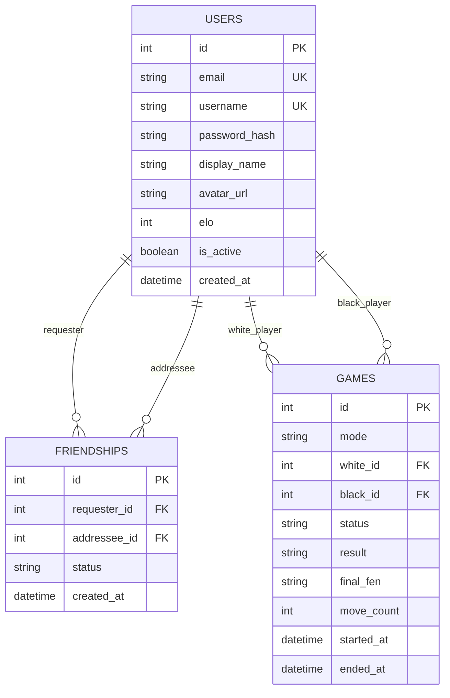

*This project has been created as part of the 42 curriculum by jrubio-m, dyanex-m, jonjimen, cde-la-r.*

# Description

**Checkmate Club** is a comprehensive, web-based multiplayer chess platform developed as the final project of the 42 core curriculum. The application provides a complete environment where users can play chess online in real-time, either against other players across the network or against a custom AI opponent. It aims to deliver a seamless, interactive user experience with real-time state synchronization, robust move validation, and a modern user interface.

Beyond the core gameplay, the platform features a full suite of social and competitive elements. These include user authentication, an Elo-based matchmaking and ranking system, persistent match histories, real-time chat, and friend management. 

# Instructions

To get the project up and running on your local machine, follow these steps:

1. **Prerequisites**: Ensure you have [Docker](https://docs.docker.com/get-docker/) and [Docker Compose](https://docs.docker.com/compose/install/) installed.
2. **Environment Variables**: Create a `.env` file in the root directory based on the provided `.env.example`. This file contains the necessary configuration for the database and API.
3. **Build and Run**: Execute `make` or `make all` in the terminal. This command will build the Docker images and start the containers. The application will be accessible via your browser.
4. **Stop**: To stop the containers without removing data, run `make down`.
5. **Clean Up**: If you need to remove the containers, images, and volumes, run `make fclean`.

# Resources

Here are some of the fundamental technologies and libraries we utilized to build this project:

- [React](https://react.dev/): A JavaScript library for building user interfaces. It allowed us to create a highly responsive and component-based frontend architecture.
- [FastAPI](https://fastapi.tiangolo.com/): A modern, fast web framework for building APIs with Python. Its asynchronous capabilities were crucial for handling our real-time websocket connections efficiently.
- [PostgreSQL](https://www.postgresql.org/): A powerful, open-source object-relational database system. We used it to reliably store user data, match histories, and game states.
- [Docker](https://www.docker.com/): A platform for developing, shipping, and running applications in containers. It simplified our deployment process and ensured environment consistency.
- [python-chess](https://python-chess.readthedocs.io/): A chess library for Python. It handled our complex server-side legal move validation and formed the backbone of our custom AI integration.
- [Socket.io / WebSockets](https://developer.mozilla.org/en-US/docs/Web/API/WebSockets_API): The protocol used for real-time, bi-directional communication between the client and the server, enabling live moves and chat.

# Team Information

- Product Owner (PO): 
- Project Manager (PM): 
- Technical Lead (TL): 
- Developers (Devs): jrubio-m, dyanex-m, jonjimen, cde-la-r.

# Project Management

Our workflow was organized through regular meetings, both in-person at the campus and online via Discord. We utilized GitHub for version control, maintaining separate branches for backend and frontend development to streamline collaboration and prevent merge conflicts, conducting code reviews via Pull Requests.

# Technical Stack

## Backend
- **Framework**: FastAPI (0.115.6) - Chosen for its high performance, automatic documentation, and native support for asynchronous programming, which is essential for real-time game loops.
- **Language**: Python 3 - Facilitates rapid development and integrates perfectly with `python-chess`.
- **Database ORM**: SQLAlchemy (2.0.36) - Provides a powerful and secure way to interact with our PostgreSQL database using Python objects.
- **Game Logic**: python-chess (1.999) - A robust library chosen to guarantee standard chess rules compliance without reinventing the wheel.

## Frontend
- **Framework**: React (18.3.1) - Selected for its component-based architecture, which makes building interactive UI elements like the game board and chat very manageable.
- **Build Tool**: Vite (6.4.3) - Used for its incredibly fast hot module replacement (HMR) and optimized production builds.
- **Chess UI**: react-chessboard (4.7.2) - A customizable and responsive React component that handles the visual representation of the board and piece dragging mechanics.

## Database
- **Engine**: PostgreSQL (16-alpine) - Chosen for its reliability, data integrity features, and excellent performance with relational data models like our user and match history structures.

# Database Schema

# Features List

## User Authentication and Management
Users can securely sign up, log in, edit their profiles, and upload custom avatars. JWT tokens are used to maintain session security. 
- *Contributors:*

## Real-time Multiplayer Chess
The core feature allows users to challenge each other and play chess in real-time. It includes server-side validation of every move, time controls, and automatic detection of checkmates and draws.
- *Contributors:*

## Social System
A comprehensive suite of social tools, including a real-time global chat, a friend request system, and live indicators to see which friends are currently online.
- *Contributors:*

## AI Opponent
Users can practice offline by playing against a custom-built chess AI. The AI features multiple difficulty levels to cater to both beginners and advanced players.
- *Contributors:*

## Leaderboard and Match History
An integrated Elo rating system dynamically adjusts player rankings based on match outcomes. Users can view a global leaderboard and check their personal match history and statistics.
- *Contributors:*

# Modules

**Total potential points: 19**

## Use a framework for both the frontend and backend (Major: +2)
The project utilizes React (built with Vite) as the frontend framework and FastAPI for the backend architecture.
- *Justification:* React provides a robust component ecosystem, and FastAPI is extremely fast for asynchronous operations needed in real-time games.
- *Contributors:* 

## Real-time features using WebSockets (Major: +2)
Implemented via `realtime.py` in the backend and `useSocket.js` in the frontend. It handles live move broadcasting, matchmaking, chat messages, and presence state.
- *Justification:* WebSockets are essential for low-latency, bi-directional communication required in multiplayer gaming and live chat.
- *Contributors:* 

## Allow users to interact with other users (Major: +2)
A comprehensive social system is implemented. This includes a live chat (`ChatCard.jsx`), friend requests and management (`FriendsPage.jsx`), and real-time online status visibility.
- *Justification:* Social features significantly increase user engagement and retention in a multiplayer environment.
- *Contributors:* 

## Use an ORM for the database (Minor: +1)
SQLAlchemy is used as the Object-Relational Mapper to interact with the PostgreSQL database, defining schemas, tables, and relationships in `models.py`.
- *Justification:* An ORM prevents SQL injection vulnerabilities and speeds up development by allowing database interactions using native Python objects.
- *Contributors:* 

## Standard user management and authentication (Major: +2)
Features secure signup and login flows (`AuthForm.jsx`), profile editing, and avatar uploads (`ProfileAvatarForm.jsx`). Secure authentication is handled via JWT tokens (`auth.py`, `tokens.js`).
- *Justification:* Essential for maintaining individual player profiles, Elo ratings, and secure access to personal data.
- *Contributors:* 

## Game statistics and match history (Minor: +1)
The application tracks user game statistics, including wins and losses, and displays past matches alongside an Elo-based ranking system (`HistoryPage.jsx`, `LeaderboardPage.jsx`, `README-elo-rating.md`).
- *Justification:* Provides players with a sense of progression and allows them to review past performances.
- *Contributors:* 

## Support for multiple languages (Minor: +1)
The UI incorporates an internationalization system allowing users to switch between at least three languages, with all user-facing text abstracted to support localization.
- *Justification:* Broadens the accessibility of the application to a wider, international user base.
- *Contributors:* 

## Support for additional browsers (Minor: +1)
The application ensures full compatibility across Chromium, Firefox, and WebKit (Safari). UI layout and WebSocket protocols are validated across these engines to guarantee consistent UX and stable connections.
- *Justification:* Ensures a seamless experience for all users regardless of their preferred web browser.
- *Contributors:* 

## Introduce an AI Opponent (Major: +2)
A custom chess AI is integrated via `ai_engine.py`. It provides human-like responses and different difficulty levels for single-player matches.
- *Justification:* Allows users to practice or play when no other players are available for matchmaking.
- *Contributors:* 

## Implement a complete web-based game (Major: +2)
A fully functional online chess game with server-side legal move validation, win/loss/draw conditions, and an interactive board UI (`GameBoard.jsx`, `boardRules.js`).
- *Justification:* The core requirement of the project, delivering a complete and playable game directly in the browser.
- *Contributors:* 

## Remote players (Major: +2)
Two players on different machines can play against each other in real-time. The system includes server-authoritative state synchronization, clock management (`Clocks.jsx`), and robust disconnection/reconnection handling (`useDisconnectGraceCountdown.js`).
- *Justification:* Ensures fair play by making the server the source of truth, preventing cheating via client-side manipulation.
- *Contributors:* 

## A gamification system (Minor: +1)
Users are rewarded with persistent achievements based on their in-game actions and overall progression. This feature is managed and rendered via `useAchievementToasts.js` and `AchievementToastContainer.jsx`.
- *Justification:* Enhances player motivation and adds an extra layer of enjoyment beyond the standard chess gameplay.
- *Contributors:* 

# Individual Contributions

## jrubio-m

## dyanex-m

## jonjimen

## cde-la-r