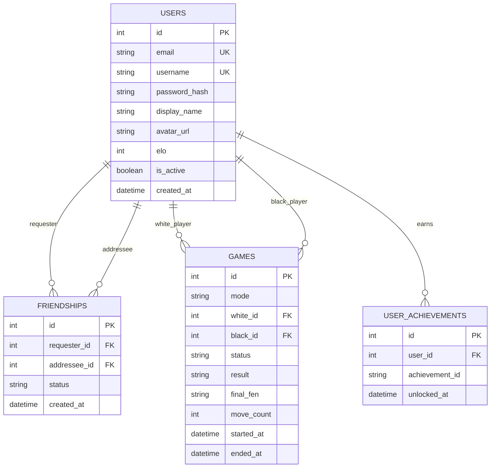

*This project has been created as part of the 42 curriculum by jrubio-m, dyanez-m, jonjimen, cde-la-r.*

# Description

**Checkmate Club** is a comprehensive, web-based multiplayer chess platform developed as the final project of the 42 core curriculum. The application provides a complete environment where users can play chess online in real-time, either against other players across the network or against a custom AI opponent. It aims to deliver a seamless, interactive user experience with real-time state synchronization, robust move validation, and a modern user interface.

Beyond the core gameplay, the platform features a full suite of social and competitive elements. These include user authentication, an Elo-based matchmaking and ranking system, persistent match histories, real-time chat, and friend management. 

# Instructions

To get the project up and running on your local machine, follow these steps:

1. **Prerequisites**: Ensure you have [Docker](https://docs.docker.com/get-docker/) and [Docker Compose v2.20.0+](https://docs.docker.com/compose/install/) (or Docker Desktop with Compose V2 enabled) installed.
2. **Environment Variables**: Create a `.env` file in the root directory based on the provided `.env.example`. This file contains the necessary configuration for the database and API.
3. **Build and Run (Production Mode)**: Execute `make` or `make all` in the terminal. This command builds the optimized production images (Frontend built and served statically) and starts the containers. The app will be securely accessible at `https://localhost:8080`.
4. **Build and Run (Development Mode)**: Execute `make dev` in the terminal. This launches the development environment with hot-reloading (HMR) enabled, binding the frontend to port 3000 with local volume mounts. The app will be accessible at `http://localhost:3000` or `https://localhost:8080`.
5. **Stop**: To stop the containers without removing persistent data, run `make down`.
6. **Clean**: To stop the containers and prune dangling images, run `make clean`.
7. **Clean Up (Deep Clean)**: To remove all containers, networks, volumes, and built images, run `make fclean`.
8. **Rebuild**: To perform a deep clean and restart the production environment, run `make re`.

# Resources

Here are some of the fundamental technologies and libraries we utilized to build this project:

- [React](https://react.dev/): A JavaScript library for building user interfaces. It allowed us to create a highly responsive and component-based frontend architecture.
- [FastAPI](https://fastapi.tiangolo.com/): A modern, fast web framework for building APIs with Python. Its asynchronous capabilities were crucial for handling our real-time websocket connections efficiently.
- [PostgreSQL](https://www.postgresql.org/): A powerful, open-source object-relational database system. We used it to reliably store user data, match histories, and game states.
- [Docker](https://www.docker.com/): A platform for developing, shipping, and running applications in containers. It simplified our deployment process and ensured environment consistency.
- [python-chess](https://python-chess.readthedocs.io/): A chess library for Python. It handled our complex server-side legal move validation and formed the backbone of our custom AI integration.
- [Socket.io / WebSockets](https://developer.mozilla.org/en-US/docs/Web/API/WebSockets_API): The protocol used for real-time, bi-directional communication between the client and the server, enabling live moves and chat.
- [SQLAlchemy 2.0 Documentation](https://docs.sqlalchemy.org/en/20/): The absolute standard for database manipulation in Python, which guided our ORM implementation and data integrity.
- [Vite Documentation](https://vitejs.dev/): Essential for understanding Hot Module Replacement (HMR) and optimizing our React production builds.
- [JWT.io (JSON Web Tokens)](https://jwt.io/): An excellent visual resource and debugger that helped us implement secure, stateless session authentication.
- [Nginx Beginner's Guide](https://nginx.org/en/docs/beginners_guide.html): A classic reference that aided in configuring our reverse proxy and SSL termination architecture.

## AI Usage Statement
Artificial Intelligence assistants were utilized during the development of this project. Specifically, they were used to propose the initial project structure, define dependencies and compatible versions, assist in code restructuring, debug errors and undesired behavior, perform text translations for multilingual support, and help draft this documentation. This usage was conscious, peer-reviewed, and acted as a legitimate development tool to streamline coding and ensure best practices.

# Team Information

- Product Owner (PO): dyanez-m (Defined the overall project scope and feature requirements, managed the product backlog, and drove the architectural migration from Django to FastAPI).
- Project Manager (PM): jonjimen (Organized development phases, coordinated team tasks and milestones, and managed initial database/seeding configuration workflows).
- Technical Lead (TL): jrubio-m (Designed the frontend architecture and React/Vite structure, established technical standards, and coordinated key API and state-synchronization designs).
- Developers (Devs): jrubio-m, dyanez-m, jonjimen, cde-la-r (Collaboratively built the core features, designed the user interface, implemented backend APIs and database relations, and synchronized real-time gameplay).

# Project Management

Our workflow was organized through regular meetings, both in-person at the campus and online via Discord. We utilized GitHub for version control, maintaining separate branches for backend and frontend development to streamline collaboration and prevent merge conflicts, conducting code reviews via Pull Requests.

# Technical Stack

## Backend
- **Framework**: FastAPI (0.115.6) - Chosen for its high performance, automatic documentation, and native support for asynchronous programming, which is essential for real-time game loops.
- **Language**: Python 3 - Facilitates rapid development and integrates perfectly with `python-chess`.
- **Database ORM**: SQLAlchemy (2.0.36) - Provides a powerful and secure way to interact with our PostgreSQL database using Python objects.
- **Game Logic**: python-chess (1.999) - A robust library chosen to guarantee standard chess rules compliance without reinventing the wheel.

## Frontend
- **Framework**: React (18.3.1) - Selected for its component-based architecture, which makes building interactive UI elements like the game board and chat very manageable.
- **Build Tool**: Vite (6.4.3) - Used for its incredibly fast hot module replacement (HMR) and optimized production builds.
- **Chess UI**: react-chessboard (4.7.2) - A customizable and responsive React component that handles the visual representation of the board and piece dragging mechanics.
- **Styling Architecture**: Hybrid approach using **CSS Modules** for scoped structural layouts and **CSS-in-JS (Styled Components)** for highly dynamic, state-dependent UI elements.

## Database
- **Engine**: PostgreSQL (16-alpine) - Chosen for its reliability, data integrity features, and excellent performance with relational data models like our user and match history structures.

## Infrastructure & Security
- **Containerization**: Docker & Docker Compose - Ensures consistent development and production environments, perfectly isolating the application architecture.
- **Reverse Proxy**: Nginx (1.27-alpine) - Acts as the single entry point for all traffic, handling SSL termination (HTTPS) and dynamically routing requests to the frontend or backend via internal secure networks.
- **Data Validation & Auth**: Pydantic & Passlib (Bcrypt) - Ensures strict incoming data validation, while passwords are cryptographically hashed using industry-standard bcrypt algorithms. JWT tokens secure the API.

# Database Schema

The database relies on three core entities strictly defined via SQLAlchemy ORM (`models.py`). This schema ensures data integrity and robust relational mapping using foreign keys and unique constraints.

# Features List

## Secure Profile Management
- **Behavioral Description:** The user can create an account, customize their display name, upload a personal avatar, and manage security settings. The system secures the session and updates the user profile globally across the platform.
- *Contributors:* dyanez-m, cde-la-r, jrubio-m, jonjimen

## Time-Control Matchmaking
- **Behavioral Description:** The system allows the user to join a matchmaking queue by selecting between 5, 10, or 30-minute limits. The system automatically pairs players in the same queue and shuffles colors randomly upon game initialization.
- *Contributors:* jrubio-m, jonjimen

## Real-Time Move Validation
- **Behavioral Description:** When dragging pieces, the interface highlights valid destination squares and automatically rejects any illegal moves according to standard chess rules.
- *Contributors:* jrubio-m, jonjimen

## AI Practice Mode
- **Behavioral Description:** The user can start a local match against an AI opponent, configuring its difficulty (Easy, Medium, Hard) and time controls. The AI calculates board states and plays moves with simulated latency to mimic human behavior.
- *Contributors:* dyanez-m, cde-la-r, jrubio-m, jonjimen

## In-Game Clocks
- **Behavioral Description:** The interface displays countdown timers representing each player's remaining time. The active player's clock counts down and pauses immediately when they register a move, subsequently starting the opponent's clock. A clock reaching zero automatically triggers a defeat by time.
- *Contributors:* jrubio-m, jonjimen

## Resignation & Draw Requests
- **Behavioral Description:** Players can click buttons to resign the match (immediately awarding the win to the opponent) or offer a draw. If a draw is offered, the opponent receives an on-screen prompt to accept or decline the tie.
- *Contributors:* cde-la-r, jrubio-m

## Live Reconnection Grace Period
- **Behavioral Description:** If a player loses their connection during a match, the system triggers a 30-second countdown. If the player reconnects before the timer expires, the game resumes; otherwise, the match is awarded to the opponent.
- *Contributors:* cde-la-r, jrubio-m

## Live Friend Management
- **Behavioral Description:** The user can search for other players by username to send friend requests. The system manages these requests (accept, decline, unfriend) and updates a visual list displaying each friend's online/offline status in real-time.
- *Contributors:* dyanez-m, jrubio-m

## Global In-Game Chat
- **Behavioral Description:** Active players can type and send text messages through a chat interface during a match. The system processes and appends these messages to a scrollable log visible to both participants instantly.
- *Contributors:* dyanez-m, jrubio-m

## Match History Archive
- **Behavioral Description:** The system registers the outcome (win, loss, draw, resignation), game mode, date, and move count of every completed game. Users can review these records in a chronological list on their profile.
- *Contributors:* dyanez-m, cde-la-r, jrubio-m, jonjimen

## Dynamic Elo Leaderboard
- **Behavioral Description:** After completing a human vs. human match, the system recalculates both players' Elo ratings based on the match outcome and the difference between their ratings. A global leaderboard ranks users by their current Elo.
- *Contributors:* dyanez-m, cde-la-r, jrubio-m, jonjimen

## Achievement Milestones
- **Behavioral Description:** The system evaluates player statistics (e.g., first win, adding a friend, reaching 1250 Elo) and triggers on-screen notifications when milestones are reached, displaying unlocked badges permanently on the user's profile.
- *Contributors:* dyanez-m, jrubio-m, jonjimen

## Hot Language Switching
- **Behavioral Description:** The user can change the application's language (English or Spanish) via a dropdown selector. The system instantly translates all user interface texts without reloading the page.
- *Contributors:* cde-la-r

# Modules

**Total potential points: 19**

## Use a framework for both the frontend and backend (Major: +2)
The project utilizes React (built with Vite) as the frontend framework and FastAPI for the backend architecture.
- *Justification:* React provides a robust component ecosystem, and FastAPI is extremely fast for asynchronous operations needed in real-time games.
- *Contributors:* dyanez-m, jrubio-m, jonjimen, cde-la-r

## Real-time features using WebSockets (Major: +2)
Implemented via `realtime.py` in the backend and `useSocket.js` in the frontend. It handles live move broadcasting, matchmaking, chat messages, and presence state.
- *Justification:* WebSockets are essential for low-latency, bi-directional communication required in multiplayer gaming and live chat.
- *Contributors:* dyanez-m, jrubio-m, jonjimen

## Allow users to interact with other users (Major: +2)
A comprehensive social system is implemented. This includes a live chat (`ChatCard.jsx`), friend requests and management (`FriendsPage.jsx`), and real-time online status visibility.
- *Justification:* Social features significantly increase user engagement and retention in a multiplayer environment.
- *Contributors:* dyanez-m, jrubio-m

## Use an ORM for the database (Minor: +1)
SQLAlchemy is used as the Object-Relational Mapper to interact with the PostgreSQL database, defining schemas, tables, and relationships in `models.py`.
- *Justification:* An ORM prevents SQL injection vulnerabilities and speeds up development by allowing database interactions using native Python objects.
- *Contributors:* jonjimen

## Standard user management and authentication (Major: +2)
Features secure signup and login flows (`AuthForm.jsx`), profile editing, and avatar uploads (`ProfileAvatarForm.jsx`). Secure authentication is handled via JWT tokens (`auth.py`, `tokens.js`).
- *Justification:* Essential for maintaining individual player profiles, Elo ratings, and secure access to personal data.
- *Contributors:* dyanez-m, jrubio-m, jonjimen

## Game statistics and match history (Minor: +1)
The application tracks user game statistics, including wins and losses, and displays past matches alongside an Elo-based ranking system (`HistoryPage.jsx`, `LeaderboardPage.jsx`, `README-elo-rating.md`).
- *Justification:* Provides players with a sense of progression and allows them to review past performances.
- *Contributors:* dyanez-m, cde-la-r, jrubio-m, jonjimen

## Support for multiple languages (Minor: +1)
The UI incorporates an internationalization system allowing users to switch between at least three languages, with all user-facing text abstracted to support localization.
- *Justification:* Broadens the accessibility of the application to a wider, international user base.
- *Contributors:* cde-la-r

## Support for additional browsers (Minor: +1)
The application ensures full compatibility across Chromium, Firefox, and WebKit (Safari). UI layout and WebSocket protocols are validated across these engines to guarantee consistent UX and stable connections.

**Browser-specific limitations:**
- **Firefox (Private Browsing / Strict Mode) & Brave:** Users may see a console warning such as *"Request for font 'Cantarell' blocked at visibility level 2"*. This is not an application error. It occurs because these browsers employ strict anti-fingerprinting shields that intercept CSS generic fallback font requests (like `sans-serif` or `system-ui`) to local OS fonts. Our CSS intentionally keeps these generic fallbacks to ensure graceful degradation across different operating systems.
- **Safari / WebKit:** The `dvh` (dynamic viewport height) CSS unit may not be supported on older Safari versions (pre-15.4). The layout gracefully falls back to `vh` units. Additionally, WebSocket reconnection timing may vary slightly due to Safari's aggressive background tab throttling.
- **Microsoft Edge:** As a Chromium-based browser, Edge behaves identically to Chrome with no known limitations. The application is fully functional and visually consistent.

- *Justification:* Ensures a seamless experience for all users regardless of their preferred web browser.
- *Contributors:* cde-la-r

## Introduce an AI Opponent (Major: +2)
A custom chess AI is integrated via `ai_engine.py`. It provides human-like responses and different difficulty levels for single-player matches.
- *Justification:* Allows users to practice or play when no other players are available for matchmaking.
- *Contributors:* dyanez-m, cde-la-r, jrubio-m, jonjimen

## Implement a complete web-based game (Major: +2)
A fully functional online chess game with server-side legal move validation, win/loss/draw conditions, and an interactive board UI (`GameBoard.jsx`, `boardRules.js`).
- *Justification:* The core requirement of the project, delivering a complete and playable game directly in the browser.
- *Contributors:* dyanez-m, jrubio-m, jonjimen

## Remote players (Major: +2)
Two players on different machines can play against each other in real-time. The system includes server-authoritative state synchronization, clock management (`Clocks.jsx`), and robust disconnection/reconnection handling (`useDisconnectGraceCountdown.js`).
- *Justification:* Ensures fair play by making the server the source of truth, preventing cheating via client-side manipulation.
- *Contributors:* dyanez-m, cde-la-r, jrubio-m, jonjimen

## A gamification system (Minor: +1)
Users are rewarded with persistent achievements based on their in-game actions and overall progression. This feature is managed and rendered via `useAchievementToasts.js` and `AchievementToastContainer.jsx`.
- *Justification:* Enhances player motivation and adds an extra layer of enjoyment beyond the standard chess gameplay.
- *Contributors:* dyanez-m, jrubio-m,  jonjimen, cde-la-r

# Individual Contributions

## jrubio-m
I focused mainly on the frontend architecture and user experience, building the application shell from the first React/Vite structure into a modular, navigable interface connected to the backend API. My work centered on turning the chess platform into a complete browser experience, with authentication screens, lobby flow, game room interaction, profile management, friends, chat, history, leaderboard, and responsive styling.

**Key Contributions:**
- **Frontend Foundation & Architecture:** Created the initial frontend structure, routing, layout system, shared styles, reusable cards, buttons, inputs, top bar, footer, and responsive base. I progressively refactored the frontend into page-based modules and smaller hooks/components to keep the project maintainable.
- **Authentication & API Integration:** Built and polished the login/register flows, form validation, token handling, expired-session behavior, and later split the frontend API layer into client, token, and error utilities.
- **Lobby & Game Room Experience:** Implemented the first lobby prototype, active game recovery, matchmaking UI states, and the modular game room foundation. I worked on drag-and-drop moves, board highlighting, promotion handling, turn-based clocks, result modals, resign/confirmation flows, error feedback, and reconnection/disconnection UI.
- **Social & Player Features:** Built the frontend for profile management, avatar editing, friends search/requests/removal, real-time chat display, match history, and leaderboard states.
- **UI Polish & Responsiveness:** Improved the visual consistency of the application across auth pages, lobby, profile, friends, leaderboard, history, and game room views. I also handled several responsive fixes, accessibility improvements, hover states, and cleanup of layout issues.

**Challenges Overcome:**
The main challenge was coordinating a fast-moving frontend with backend game state, authentication, WebSocket events, and multiple user flows at once. The game room in particular required careful state management because board interaction, clocks, chat, reconnect handling, modals, and server updates all had to stay synchronized without making the UI feel unstable or confusing.
## jonjimen
I contributed mainly to the backend foundation and the data layer of the project. My work focused on structuring the server-side architecture, defining the initial database models and migrations, and connecting the API to persist player and match information reliably.

**Key Contributions:**
- **Backend Architecture:** Helped refactor the backend into a more modular structure, establishing the initial apps, migrations, and error-handling approach.
- **Database & Environment Setup:** Set up PostgreSQL integration, environment configuration, and seed scripts so the application could initialize its database consistently.
- **Game Results & Match Persistence:** Implemented the game result flow with dedicated models, serializers, and views so match outcomes and related metadata could be saved and exposed via the API.
- **Match Logic Refinements:** Contributed to backend rules around matchmaking and match handling, including adjustments to ensure rating updates were applied consistently for completed games.

**Challenges Overcome:**
The main challenge was building a solid backend foundation while keeping the data model aligned with the evolving requirements of real-time gameplay, match history, and user management.
## dyanez-m
I served as the core backend architect and developer, laying the foundation for the application's infrastructure. After a major restructuring of the team, I took on the responsibility of manually rebasing the repository and migrating the entire backend architecture from Django to a high-performance, asynchronous FastAPI framework. My focus was on implementing the real-time gameplay loops, secure session management, persistent data layers, and gamification elements.

**Key Contributions:**
- **FastAPI Backend Architecture:** Designed and implemented the complete asynchronous backend from scratch. Developed the modular routing system (`auth.py`, `friends.py`, `games.py`, `matchmaking.py`, `users.py`), configured PostgreSQL database integrations via SQLAlchemy 2.0 ORM schemas, and set up the main application life-cycle and dependencies.
- **Real-Time WebSockets & Presence:** Created the WebSocket server engine (`realtime.py`) to handle low-latency communications. This included managing real-time multiplayer connections, game-state broadcasting, active player lobbies, global chat message propagation, and immediate online/offline presence synchronization linked to user authentication status.
- **Matchmaking & Gameplay Robustness:** Implemented backend logic to validate player status, including prevention mechanisms to block players from entering multiple games or queues concurrently (1v1 vs. AI). Integrated display name metadata and check/checkmate (`is_check`) calculations into the synchronized game state.
- **Gamification & Achievements:** Developed the backend models for player achievements. On the frontend, designed and built the interactive Achievements Tab on the profile page, along with dynamic, slide-in toast notifications to celebrate unlocked milestones.
- **Security & SSL Configuration:** Set up the Nginx reverse proxy configuration to support HTTPS connections using self-signed SSL certificates. Integrated secure JWT-based stateless authentication, handling expired tokens in the frontend to gracefully redirect users back to the login page.

**Challenges Overcome:**
The most significant challenge was the full migration from Django to FastAPI. Refactoring all views, models, and serializers into asynchronous FastAPI endpoints and SQLAlchemy schemas while maintaining system integrity required a deep understanding of async programming. Additionally, synchronizing WebSocket connection states with DB transactions during rapid moves and unexpected disconnections required implementing robust error containment and state recovery.
## cde-la-r
I joined the project in its advanced stages as the final developer. My primary goal was to polish the user experience, implement remaining core frontend mechanics, and ensure overall stability and security. 

**Key Contributions:**
- **UX & Gameplay Improvements:** Implemented the "Offer Draw" feature and integrated Standard Algebraic Notation for the move history. I also overhauled the AI game UX to provide immediate feedback for player moves instead of waiting for the AI calculation.
- **Matchmaking & Connections:** Prevented edge cases like queuing for AI matches while waiting in the 1v1 lobby. I completely reworked the disconnection countdown logic, fixing a critical bug where countdowns wouldn't trigger correctly if a player intentionally logged out mid-game.
- **Profile & Progression:** Built the public profile viewing functionality and designed a level progression system with a dynamic progress bar based on the user's Elo.
- **Multi-language Support:** Implemented the full i18n system for English, Spanish, and French according to the subject's strict requirements.
- **Security, Performance & Bug-hunting:** Updated Vite and core dependencies to resolve `npm audit` vulnerabilities. Cleaned up React console warnings, fixed CSS overflow issues during pawn promotion, and implemented session persistence across browser tabs (allowing seamless 1v1 testing via incognito mode). Finally, I audited and hardened the Docker infrastructure, explicitly isolating environment variables to enforce the Principle of Least Privilege and securing the Nginx reverse proxy.

**Challenges Overcome:**
The biggest challenge was wrapping my head around the complex WebSocket and state-management logic written by the rest of the team to fix the disconnection countdown bugs. It required carefully tracking component unmounts and session states to ensure the timer worked flawlessly regardless of how the user disconnected (closing tab, losing WiFi, or clicking logout).
